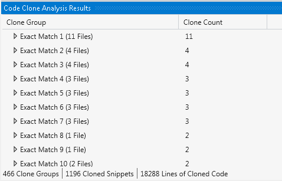

# Code Clone Detection #

[Code Clone Detection](http://bit.ly/EDC-CodeCloneDetection) is a feature of Visual Studio, but is only available in the Ultimate or Premium levels.  You can find all clones in a solution, or find clones of a specific fragment.

In addition to discovering direct copies, the clone analysis tool can find fragments which differ in the names of variables and parameters, and in which some statements have been rearranged.

The output of the solution wide code clone analysis is a list of clone groups ordered with the highest number of clones at the top:

The results include exact matches, strong, medium and weak matches in that order.  When you expand one of the clone groups, you see the files with duplicate code, including the line numbers where the code is duplicated.  You can then double click on the file to navigate to the code in question. 
